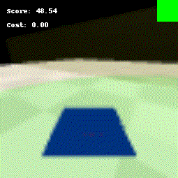

# NightMare Dreamer ( Releasing Soon )

We dream about unsafe states and plan ahead to satisfy constraints using a multi agent approach.

To run
```
git clone https://github.com/tohsin/Nightmare-Dreamer.git
pip install requirements.txt
python ma_dreamer.py
```

### Important Information:

1. Videos will Log in the logdir and be named eval_video
2. The green on the top right corner means no constraint detected and agent uses Control Policy
3. The red on top right means Constraint detected and agent had switched to a Safe Policy
4. Circle doesn't switch because intrestingly the control polciy eventually converges to a safe and optimal policy

## NightMare Dreamer Agent Solving Goal and Circle
|                                  |                                                |
| :------------------------------: | :--------------------------------------------: |
|         `Goal`          |              `Circle`                    |
|  |  |

Will add other tasks and plots soon.
